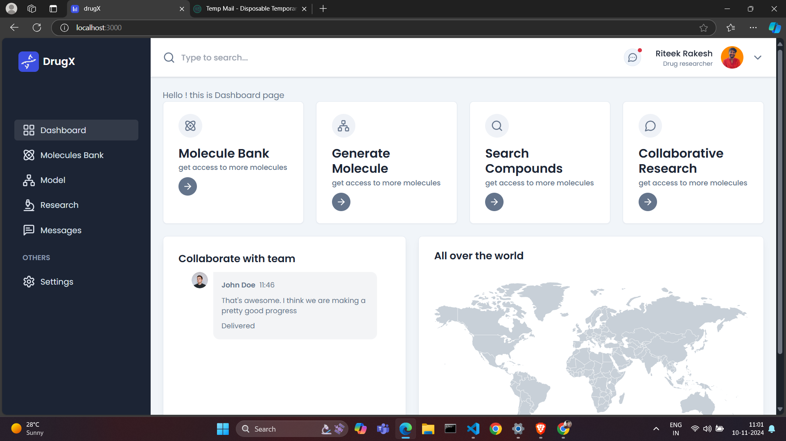

<div align="center">
  <h1 align="center">DrugX: A drug discovery and protein-binding prediction tool</h1>
  <br />

  <div>
    
    
    
    
  </div>
 <br />
   
</div>


## <a name="introduction">🤖 Introduction</a>

**DrugX** is a drug discovery and protein-binding prediction tool built with the latest in machine learning and natural language processing (NLP) technology. Powered by NVIDIA NIM and protein structure prediction models, this project enables users to simulate molecular interactions and predict protein structures.

The platform is designed to help researchers accelerate drug discovery by leveraging cutting-edge AI models for protein folding, docking, and molecular dynamics.


## <a name="tech-stack">⚙️ Tech Stack</a>

- **Next.js**
- **TypeScript**
- **NVIDIA** (for protein/drug structure prediction)
- **Tailwind CSS**
- **React Chart.js** (for visualizing protein data)

## <a name="features">🔋 Features</a>

👉 **Protein Structure Prediction**: Predicts 2D protein structures using NVIDIA models.

👉 **Collaborative Research**: Researches can create groups and colloborate with other research online

👉 **Responsive Design**: Ensures seamless experience across all devices, from desktops to mobile.

## <a name="quick-start">🤸 Quick Start</a>

Follow these steps to set up the project locally on your machine.

### **Prerequisites**

Make sure you have the following installed on your machine:

- [Git](https://git-scm.com/)
- [Node.js](https://nodejs.org/en)
- [npm](https://www.npmjs.com/) (Node Package Manager)


### **Installation**

Install the project dependencies using npm:

```bash
npm install
```

### **Set Up Environment Variables**

Create a new file named `.env` in the root of your project and add the following content:

```env
NEXT_PUBLIC_NVIDIA_API_KEY=your-nvidia-api-key

ABLY_API_KEY='your-ably-api-key'

MONGODB_URL='your-mongodb-url'

NEXT_PUBLIC_API_BASE_URL=http://localhost:3000

RESEND_KEY='your-resend-api-key'
```

### **Running the Project**

```bash
npm run dev
```

Open [http://localhost:3000](http://localhost:3000) in your browser to view the project.

## <a name="protein-data">🧬 Drug Data Processing</a>

This section covers the protein data processing pipeline, including loading protein structure files (e.g., PDB format), performing molecular docking simulations, and visualizing the results.

### **Protein/Drug Structure Input**

Users can upload PDB files for protein structures, which will then be processed by NVIDIA NeMo's protein-folding models.

### **Docking Simulation**

Using molecular docking algorithms, the system predicts how small molecules (such as drug candidates) bind to protein targets.


